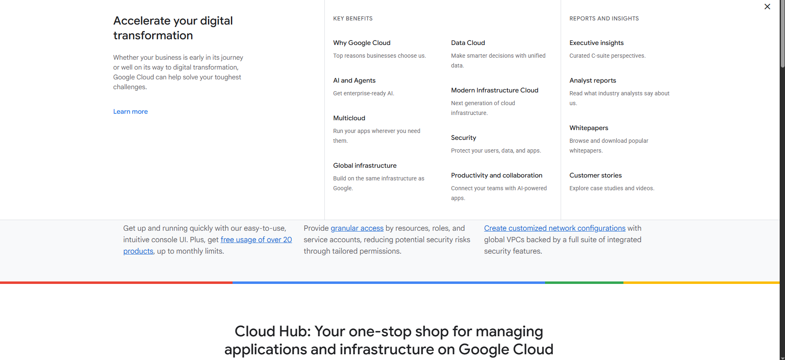

# Amazon Web Services (AWS) Research

## 1. Brief Overview

Amazon Web Services (AWS) is a cloud platform developed by Amazon. I learned that AWS provides different services that allow users and businesses to store data, run applications, use databases, and manage servers through the internet.

## 2. Global Infrastructure

AWS has data centers located in different parts of the world. These are organized into **Regions** and **Availability Zones**. I learned that Regions represent different geographic locations, while Availability Zones help keep applications and services available even if one location has a problem.

## 3. Cloud Management Console

The **AWS Management Console** is the website where I can manage AWS services. I can use it to create and manage servers, storage, databases, and other cloud resources.

## 4. Four (4) Core Services

### Amazon EC2

Amazon EC2 allows me to create virtual servers in the cloud. I can use these servers to run websites and applications.

### Amazon S3

Amazon S3 is a storage service. I can use it to store files, images, videos, backups, and other data.

### Amazon RDS

Amazon RDS is a managed database service. It makes it easier to create and manage databases for applications.

### Amazon VPC

Amazon VPC allows me to create a private network in AWS. It helps me control how my cloud resources communicate with each other.

## 5. Three (3) Advantages

### 1. Scalability

I can increase or decrease my resources depending on how much I need. This is useful when an application suddenly gets more users.

### 2. Global Availability

AWS has many Regions around the world. This allows businesses to provide their applications and services to users in different locations.

### 3. Many Services

AWS offers many different services for computing, storage, databases, networking, security, and other technologies. This gives users many options when building applications.

## 6. Typical Enterprise Use Cases

I learned that businesses commonly use AWS for:

* Hosting websites and applications
* Storing and backing up important files
* Managing business databases
* Running online stores and e-commerce websites
* Analyzing large amounts of data
* Running applications that need to support many users
* Creating backup and disaster recovery systems

Overall, I learned that AWS is useful for businesses because it provides many cloud services without requiring them to maintain their own physical servers.

