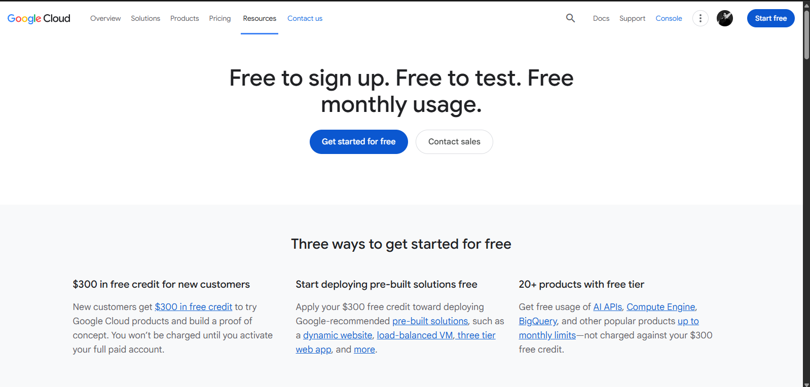

# Google Cloud Platform (GCP) Research

## 1. Brief Overview

Google Cloud Platform (GCP) is a cloud computing platform developed by Google. I learned that GCP provides different services that allow users and businesses to run applications, store data, manage databases, and use other cloud resources through the internet.

## 2. Global Infrastructure

GCP has data centers and cloud infrastructure located in different parts of the world. These are organized into **Regions** and **Zones**. I learned that Regions are geographic locations, while Zones are locations within a Region where Google Cloud resources can run.

This global infrastructure helps businesses run their applications closer to their users and improve the availability of their services.

## 3. Cloud Management Console

The **Google Cloud Console** is the website where I can manage Google Cloud services. I can use it to create virtual machines, manage storage and databases, configure networks, and monitor my cloud resources.

## 4. Four (4) Core Services

### Compute Engine

Compute Engine allows me to create virtual machines in the cloud. I can use these virtual machines to run websites, applications, and other software.

### Cloud Storage

Cloud Storage allows me to store files and other data in the cloud. I can use it for images, videos, backups, documents, and application data.

### Cloud SQL

Cloud SQL is a managed database service. It allows me to create and manage relational databases without having to manage the physical database servers.

### Google Virtual Private Cloud (VPC)

Google Cloud VPC allows me to create a private network for my cloud resources. It helps control how my virtual machines and other services communicate with each other.

## 5. Three (3) Advantages

### 1. Strong Data and AI Services

I learned that Google Cloud has many services for data analytics, artificial intelligence, and machine learning. This makes it useful for businesses working with large amounts of data.

### 2. Global Network

GCP has a large global network that connects its cloud infrastructure around the world. This can help applications provide good performance for users in different locations.

### 3. Scalability

GCP allows me to increase or decrease cloud resources depending on the needs of an application. This helps businesses handle changes in their workload.

## 6. Typical Enterprise Use Cases

I learned that businesses commonly use GCP for:

* Hosting websites and applications
* Storing and backing up company data
* Managing business databases
* Data analytics and processing
* Artificial intelligence and machine learning
* Running virtual machines
* Developing and testing applications

Overall, I learned that GCP is a useful cloud platform for businesses because it provides scalable cloud services, a global network, and strong tools for data and artificial intelligence.

